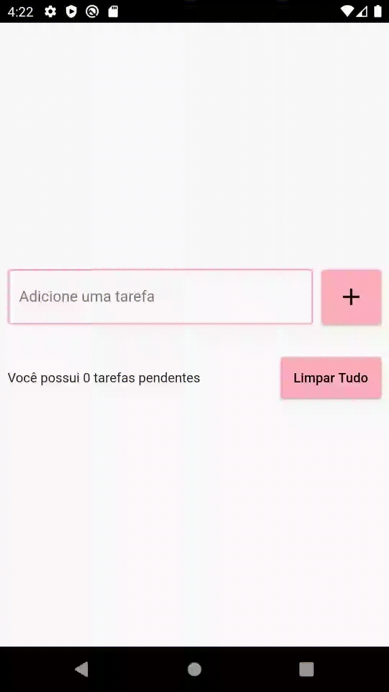

   <h1 align="center">To-do List app made with Flutter</h1>

   <h2 align="center">Summary</h2>

   

   
- [About the app ](#about-the-app-)

- [Preview of the finished app](#preview-)

- [Tecnologies used in the project](#tecnologies-used-in-the-project-)

---

   <h2 align="center">About the app </h2>
   
   

    This app was developed to study local persistence of data, as well as JSON encoding and decoding of the persisted data. It consists in a todo list app, where you can add tasks, delete one (and have the option reverse the deletion) or delete all of your tasks.

   

---

   <h2 align="center">Preview </h2> 

   

   
   

---

   <h2 align="center">Tecnologies used in the project </h2>

   During the development of this app, a lot of different tools of the <a href="https://flutter.dev/">Flutter</a> framework were used, such as the following widgets and principles : 
   
    - OOP,
    - JSON encoding/decoding,
    - SharedPreferences,
    - Local Persistence,
    - Initial State management,
    - SizedBox,
    - ListView,
    - Flexible

---

   
  

